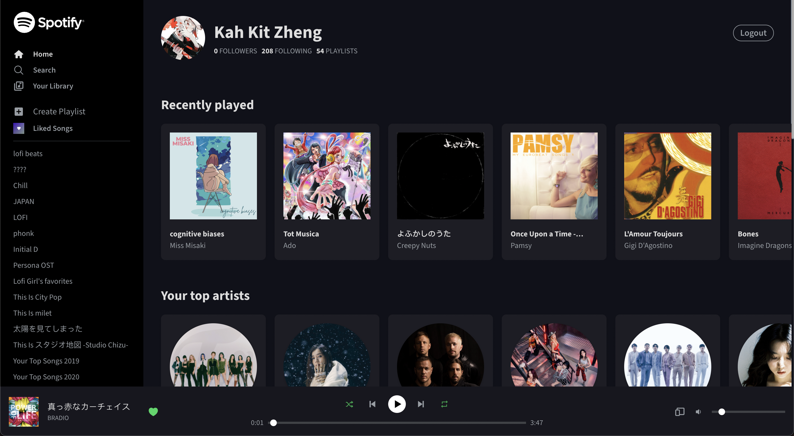

# Spotify - TS

Yet another Spotify clone on the web. The biggest difference is that
it has almost all of the core features implemented. This includes
playing songs with the Spotify Web Playback SDK, creating playlists,
saving and browsing songs. Furthermore it is created with both mobile and
desktop viewport in mind.

---



---

## Getting Started

To get this application up and running, several configurations must be set.

### Spotify Dashboard

Start off by creating a new Spotify app in your [Spotify Developer Dashboard](https://developer.spotify.com/dashboard/login).
Go to **Edit Settings** and add the callback urls of your development and
production environment to the Redirect URIs. This is your base url with
`/callback` appended to it. For example the development environment is: `http://localhost:8888/callback`.

### Server

Next go to the server folder and make a copy of `.env.example` and rename it to `.env`. The values of Client ID and Client Secret can be found in your Spotify Dashboard. Afterwards install the dependecies with

```
npm install
```

and start the server with

```
node index.js
```

### Client

For the client side there isn't much to do except for installing the dependecies. Unless you are planning to deploy it to production. Then you need to go `src/spotify/auth.ts` and replace the refresh url with the url of your production server.

install the dependecies

```
npm install
```

start the app

```
npm run start
```

---

## Hosting on Vercel

Create a new project in your [Vercel Dashboard](https://vercel.com/dashboard) and import the repository of spotify-ts. If the project is not visible in the list. then it can mean two things. You either need to filter the list using the search bar since only five projects can be displayed at once or you have not given Github permission yet to let Vercel have access to this project. To fix this go to _Github > Settings > Applications > Vercel > Configure > Repository Access_.

After selecting the repo, you need to change the framework preset to `Create React App` and set the root directory to `client`. Now all the configuration on the client is set, you can select deploy.

As for the server side, you need to create another Vercel project as instructed above. The difference here is that you need to set the framework preset to `Other` and the root directory to `server`. Once the project is created go to the settings page and select the _Environment Variables_ tab. Here you need to add the following variables: `CLIENT_ID`, `CLIENT_SECRET`, `FRONTEND_URI` and `REDIRECT_URI`.

`CLIENT_ID` and `CLIENT_SECRET` are the same as the ones in your Spotify Dashboard. The `FRONTEND_URI` is the production url of your client application and `REDIRECT_URI` is the same url as your production server with `/callback` appended to it.

---

## Built With

- Create React App
- TypeScript
- Redux Toolkit
- styled-components
- Spotify Web API
- Spotify Web Playback SDK

## Known problems

[] Spotify playback SDK does not work after access token is expired (1 hour).
